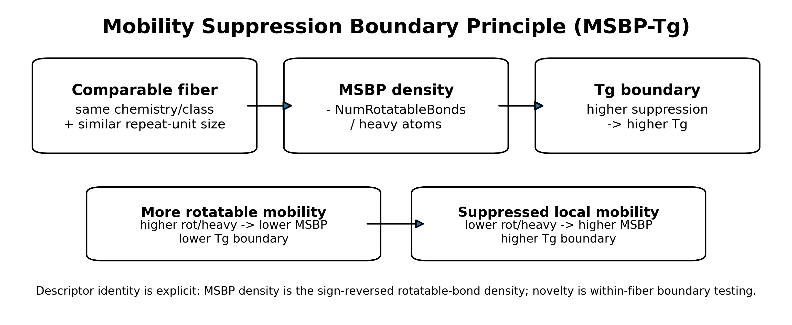
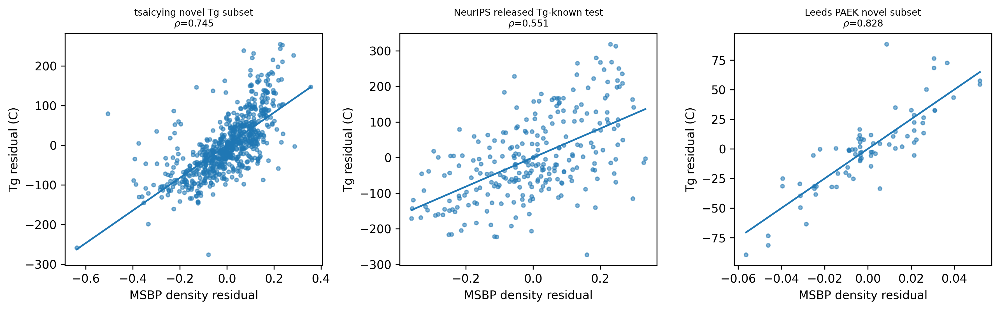
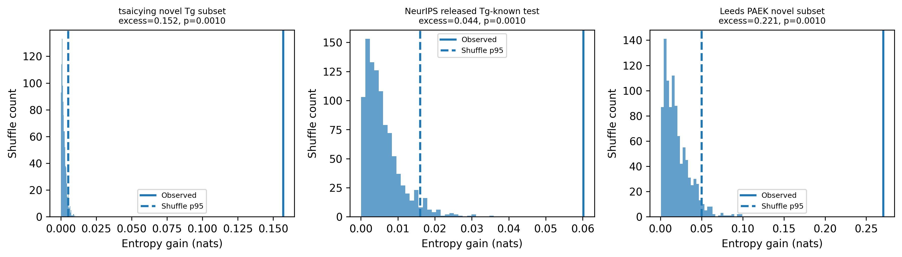

# Abstract

Polymer glass-transition temperature (Tg) remains difficult to interpret across structurally related repeat units because visible chemistry and molecular size do not fully determine residual property differences. This study evaluates the Mobility Suppression Boundary Principle (MSBP-Tg) as a public-safe cheminformatics validation study. Within comparable chemistry-size fibers, upward residual Tg displacement is tested for association with suppression of normalized local rotatable mobility. The MSBP density coordinate is exactly the sign reversal of rotatable-bond density, MSBP density = -NumRotatableBonds/heavy_atoms; therefore, the contribution is not the invention of a new molecular descriptor. Instead, the contribution is the use of a familiar mobility descriptor as an interpretable within-fiber suppression coordinate combined with residualization, source-family checks, descriptor comparisons, shuffle controls, bootstrap summaries, and contradiction taxonomy. Three post-lock source-family checks are consistent with this framing: a broad leak-excluded public Tg subset, a released NeurIPS Tg-known test subset, and a family-narrow Leeds PAEK stress test. Across these public-safe aggregate checks, the mobility-suppression coordinate gives directionally consistent support for upward Tg displacement while preserving explicit limitations around source bias, family narrowing, raw-data redistribution, and prospective experimental validation. The study is positioned as an interpretable polymer-informatics screening and validation workflow, not as a universal Tg law, a new descriptor claim, or a replacement for experimental glass-transition measurement.

# 1. Introduction

The glass-transition temperature (Tg) is a central property for polymer design because it marks the temperature range where amorphous segmental mobility becomes dynamically accessible. Classical explanations emphasize molecular weight, free volume, cooperative relaxation, configurational entropy, and empirical structure-property correlations [1-8]. Modern polymer-informatics and cheminformatics models can predict Tg using molecular descriptors, fingerprints, graph representations, chemical language models, and learned representations [9-13]. However, predictive accuracy alone does not always isolate an interpretable coordinate that explains why related repeat units move toward a higher or lower Tg boundary.

The narrower question addressed here is therefore not whether Tg can be predicted from molecular structure in general. The question is whether a physically transparent mobility coordinate organizes residual Tg displacement after visible polymer family and approximate repeat-unit size have been accounted for. MSBP-Tg tests this question inside chemistry-size fibers, where comparisons are made among repeat units that are closer in visible chemistry and size rather than across all polymers at once.

This framing makes the present work a cheminformatics validation study rather than a universal theory of glass transition. The coordinate tested here, MSBP density, is the sign-reversed normalized rotatable-bond density. It is not introduced as a new molecular descriptor. Its value is in reorienting a familiar descriptor into a suppression-coordinate interpretation and then testing whether that coordinate remains associated with upward Tg boundary displacement under residualization, source-family checks, comparator descriptors, shuffle controls, and contradiction analysis.

A public-safe release model is used because several third-party Tg sources cannot be redistributed row by row. The accompanying GitHub and Zenodo records therefore provide source documentation, public-safe derived tables, aggregate validation outputs, figures, tests, and reproducibility scripts, while preserving raw-data redistribution boundaries. A ChemRxiv preprint version is publicly available at https://doi.org/10.26434/chemrxiv.15005629/v1.

# 2. Mobility-suppression coordinate and contribution

The MSBP-Tg working statement tested here is narrower: within comparable polymer chemistry-size fibers, reduced normalized rotatable mobility is expected to associate with upward residual Tg boundary displacement, while increased local mobility is expected to associate with downward residual displacement. A visible fiber is a reproducible grouping by polymer-family or raw chemistry label plus a molecular-size bin.

Tg marks the onset temperature for cooperative segmental chain motion. Repeat units with fewer rotatable bonds per heavy atom have lower local conformational freedom, so local rearrangements require higher thermal energy. The MSBP density coordinate therefore represents normalized resistance to local conformational motion, rather than a new molecular descriptor.

Different polymer families carry systematically different baseline Tg levels due to cohesion, polarity, packing, intermolecular interactions, and backbone chemistry. Testing MSBP-Tg within comparable chemistry-size fibers reduces these baselines and asks whether normalized local mobility suppression organizes the remaining within-family Tg boundary displacement.

Raw rotatable-bond count is size-confounded: larger repeat units tend to contain more rotatable bonds simply because they contain more atoms. Dividing by heavy-atom count normalizes this size effect, so the axis measures local rotational-freedom concentration rather than repeat-unit size.

Descriptor transparency statement. MSBP density is exactly the negative of rotatable-bond density: rot_density = NumRotatableBonds/heavy_atoms and MSBP_density = -rot_density. The paper does not claim discovery of a new descriptor. The manuscript's claim is narrower: a familiar mobility descriptor is reoriented as a suppression coordinate and evaluated through within-fiber residualization, post-lock source-family checks, entropy controls, and contradiction taxonomy.

## 2.1 Contribution statement

This manuscript contributes four items for the cheminformatics and polymer-informatics setting:

1. a suppression-oriented interpretation of normalized rotatable mobility for polymer Tg boundary displacement;
2. a within-fiber residualization protocol that separates chemistry-size baselines from local mobility suppression;
3. a public-safe validation workflow using source-family checks, descriptor comparisons, bootstrap summaries, shuffle controls, and contradiction taxonomy; and
4. a reproducibility package linking the manuscript to GitHub, Zenodo, and ChemRxiv records while respecting raw third-party data redistribution limits.

The contribution is therefore methodological and interpretive. It does not claim a complete theory of Tg, a universal law of polymer glass transition, a causal proof of glass-transition mechanism, or a replacement for experimental measurement.

## 2.2 Claim boundary

Throughout this manuscript, the term "principle" is used as the name of the tested MSBP-Tg working hypothesis and coordinate framing. It should not be read as a claim that a universal physical law of polymer glass transition has been established. The present evidence supports a narrower statement: within the public-safe source-family checks reported here, sign-reversed normalized rotatable-bond density is directionally associated with upward Tg displacement after chemistry-size residualization. The analysis does not establish causality, does not replace experimental Tg measurement, and does not remove the need for prospective validation on new polymer candidates.

# 3. Relationship to existing work

MSBP-Tg is positioned between classical polymer glass-transition theory and modern polymer informatics. Classical Tg accounts emphasize molecular-weight effects, relaxation-temperature scaling, configurational entropy, cooperative rearrangement, free volume, and the general physics of supercooled liquids and glasses [1-8]. These theories provide the physical background for why local mobility and constrained rearrangement matter, but they are not used here as a full mechanistic derivation of Tg.

Empirical polymer-property estimation methods, including group-contribution and handbook-style structure-property approaches, provide a second point of reference [9,10]. Such methods are valuable for engineering estimation, but the present manuscript asks a narrower residual question: after visible chemistry and approximate repeat-unit size have been controlled through chemistry-size fibers, does a simple local-mobility coordinate still organize residual Tg displacement?

Modern polymer informatics has shown that machine-learning models, chemical language models, and descriptor- or motif-based representations can predict Tg from repeat-unit structure [11-14,20,21]. Polymer Genome demonstrates the broader value of data-powered polymer-property prediction [11]. Chemical-language approaches show that polymer repeat-unit SMILES can be used directly as sequence inputs for Tg prediction [12]. Recent QSPR-GAP work on PAEK polymers shows that compact descriptor/motif models can be accurate and transferable inside a chemically focused family [13,14]. These studies motivate the present work, but MSBP-Tg is not proposed as a higher-accuracy global Tg predictor. Its target is interpretability: whether sign-reversed normalized rotatable-bond density behaves as a transparent mobility-suppression coordinate inside comparable fibers.

The cheminformatics representation layer is intentionally simple. Repeat-unit structures are represented by SMILES and parsed with RDKit, a standard open-source cheminformatics toolkit used for molecular parsing and descriptor calculation [17,18]. The main coordinate is not learned from data and is not a new descriptor: it is exactly the negative of rotatable-bond density. Comparator descriptors, including ring density, aromatic-ring density, heteroatom density, and heavy-atom count, are included to test whether the observed residual association is merely a proxy for familiar rigidity or size descriptors.

The validation design follows reproducible-computational-research norms. Bootstrap summaries are used to report uncertainty around rank association and paired descriptor comparisons [22]. Public-safe source documentation and release metadata are used because raw third-party data redistribution rights differ across sources; this follows the practical spirit of reproducible research and FAIR-oriented data stewardship, where code, provenance, metadata, and reusable derived artifacts are made available when unrestricted raw redistribution is not possible [23-26]. The public package therefore emphasizes source documentation, public-safe derived tables, scripts, tests, and archived GitHub/Zenodo records rather than unrestricted redistribution of all row-level third-party records.

Within this context, the three post-lock source-family checks play different roles. The broad public Tg subset provides the largest leak-excluded validation source [19]. The NeurIPS/Open Polymer source gives a benchmark-style check from a separate released polymer-property family [15,16]. The Leeds PAEK source gives a family-narrow stress test connected to recent QSPR-GAP Tg modeling [13,14]. Agreement across these sources is treated as directional support for the mobility-suppression coordinate; differences between them are treated as limitations and source-family evidence rather than failures to be hidden.

# 4. Data sources and source roles

Three post-lock source-family checks were used. The tsaicying polymer Tg subset is the broadest leak-excluded public Tg source and is used only through derived, non-redistributed validation summaries [19]. The NeurIPS released Tg-known subset provides a benchmark-style check from the Open Polymer Prediction source family; it is directionally supportive but weaker in entropy separation [15,16]. The Leeds PAEK subset comes from the Brierley-Croft et al. Macromolecules work and associated University of Leeds Research Data archive [13,14]. It is an independent family-narrow stress test, not a broad chemical-diversity validation. After screening, the Leeds subset contains only aromatic/rigid-backbone PAEK entries, which is informative but should not be generalized as broad coverage.

Public source provenance is documented in the repository source register (`data/external_sources.csv` and `data/external_sources.md`). Raw third-party records and row-level third-party-derived structural/property tables are not redistributed. For local reproduction, readers must reacquire source files from the original providers, record current license or access terms, prepare local feature tables under `data/processed/`, and then rerun the public validation scripts. This makes the released package a public-safe verification package for aggregate evidence, not a raw-data redistribution mirror.

# 5. Methods

## 5.1 SMILES and descriptor handling

Repeat-unit SMILES were parsed with RDKit using SMILES string representations [17,18]. Rows that could not be parsed were screened out. Polymer dummy atoms (*) were retained when RDKit parsing allowed the representation and were not treated as chemical heavy atoms for the normalized mobility denominator. Descriptor extraction used RDKit NumRotatableBonds, heavy-atom count, ring count, aromatic-ring count, heteroatom count, and explicit silicon atom count. The silicon atom count was added as a direct atomic-number-14 feature to avoid misassignment of silicon-like fibers. The public environment specifies rdkit>=2023.9.1; the Step 7 QA environment reported RDKit 2025.09.4. Future reruns should record rdkit.__version__ with the generated feature table.

## 5.2 MSBP density definition

The locked density coordinate is MSBP_density = -NumRotatableBonds/heavy_atoms. The count coordinate is MSBP_count = -NumRotatableBonds. The sign convention makes higher values mean greater mobility suppression. Because MSBP density is non-positive for ordinary repeat units, higher suppression corresponds to values closer to zero. Because this coordinate is exactly the sign-reversed rotatable-bond density, MSBP density and rot/heavy have equal absolute rank correlations by definition.

## 5.3 Fiber definition and residualization

A visible fiber combines a raw chemistry/family label with a molecular-size bin. Where a dataset supplied polymer class labels, those labels were used. Otherwise a rule-based heuristic assigned simple chemistry families using silicon atoms, aromatic rings, heteroatom status, and hydrocarbon-like fallback categories. These fibers are analysis strata, not claims of complete polymer taxonomy. The main public-code protocol computes residuals by subtracting the within-fiber mean from Tg and from the mobility-suppression coordinate. The reported rank correlations are Spearman correlations between these mean-centered residualized coordinate values and mean-centered residualized Tg values. Median-centering is retained only as a sensitivity check; it preserves the same positive direction across all three source-family checks (Supplementary Table S1, `tables/residual_centering_sensitivity.csv`).

Residual-centering sensitivity. Main results use within-fiber mean-centering to match `src/msbp_tg/metrics.py::residualize_by_group`; median-centering is reported only as a robustness check. The mean-centered source summaries are: Stage 10, n = 739, fibers = 64, rho = 0.745, sign accuracy = 0.903, entropy gain = 0.157; Stage 11, n = 261, fibers = 36, rho = 0.551, sign accuracy = 0.780, entropy gain = 0.060; and Stage 13, n = 78, fibers = 7, rho = 0.828, sign accuracy = 0.950, entropy gain = 0.271. The corresponding median-centered sensitivity values preserve the same positive direction: Stage 10 rho = 0.744 and sign accuracy = 0.910; Stage 11 rho = 0.531 and sign accuracy = 0.742; Stage 13 rho = 0.832 and sign accuracy = 0.949.

## 5.4 Entropy and shuffle controls

Boundary uncertainty was summarized as binary entropy in nats. Axis quantile bins were compared with a high-Tg boundary label. The null control shuffled the axis 1000 times. Empirical p-values were computed as (1 + number of shuffled statistics at least as large as observed) / (1 + number of shuffles).

## 5.5 Descriptor comparison and bootstrap uncertainty

Known descriptor comparisons include rotatable-bond density, ring density, aromatic-ring density, heteroatom density, and heavy-atom count. Since MSBP density is exactly the sign reversal of rot/heavy, equal absolute correlations are expected. For other descriptor comparisons, paired bootstrap confidence intervals estimate the difference in absolute correlation. Spearman confidence intervals were estimated with bootstrap resampling. Effect-size slopes were calculated as source-local OLS slopes of Tg residual on MSBP-density residual. These slopes are magnitude anchors, not universal constants.

## 5.6 Public-safe figure and table alignment

All figures cited in the manuscript are provided as public-safe image files in `figures/`. Figure 1 is the theory schematic, Figure 2 reports residual scatter summaries, Figure 3 reports shuffle-control distributions, and Figure 4 provides synthetic illustrative repeat-unit motifs. These motif images are not row-level third-party dataset records.

The public-safe tables used to support the manuscript are provided as CSV files in `tables/` and `results/`. The main source-level residual association summary is `results/three_source_recomputed_summary.csv`. Supplementary Table S1 is `tables/residual_centering_sensitivity.csv`; Supplementary Table S2 is `tables/bootstrap_ci_spearman.csv`; Supplementary Table S3 is `tables/entropy_shuffle_empirical_p.csv`; Supplementary Table S4 is `tables/known_descriptor_comparison_compact.csv`; Supplementary Table S5 is `tables/paired_descriptor_bootstrap_ring_summary.csv`; Supplementary Table S6 is `tables/effect_size_slope_compact.csv`; Supplementary Table S7 is `tables/contradiction_taxonomy_source_summary.csv`; and Supplementary Table S8 is `tables/source_role_notes.csv`. Longer machine-readable tables are retained in the same directory when they are needed for audit or reproduction.

# 6. Results

## 6.1 Locked residual association

## 6.2 Shuffle controls

## 6.3 Known descriptor comparison

Supplementary Table S4 (`tables/known_descriptor_comparison_compact.csv`) reports comparator descriptors. MSBP density is not listed as an independent comparator because it is exactly -rot/heavy. The rot/heavy row is included to make this identity explicit; the meaningful alternatives are ring density, aromatic-ring density, heteroatom density, and size proxies.

## 6.4 Paired descriptor bootstrap

In the broad tsaicying source and the family-narrow Leeds source, MSBP density is distinguishable from ring-density alternatives by paired bootstrap. In the smaller NeurIPS source, the paired bootstrap intervals include zero for ring-density comparisons; this source therefore supports the mobility direction but not a strong superiority claim over ring density. The compact public-safe paired-bootstrap summary is provided as Supplementary Table S5 (`tables/paired_descriptor_bootstrap_ring_summary.csv`), with the longer machine-readable table retained as `tables/paired_descriptor_bootstrap.csv`.

## 6.5 Effect-size slopes

Supplementary Table S6 (`tables/effect_size_slope_compact.csv`) reports source-local OLS slopes of Tg residual on MSBP-density residual. These slopes are not proposed as universal constants; they are magnitude anchors for the evaluated sources. The wider machine-readable audit file is retained as `tables/effect_size_slope.csv`.

## 6.6 Contradiction taxonomy

Contradiction rates differ by source and contradiction class. The source-level contradiction summary is provided as Supplementary Table S7 (`tables/contradiction_taxonomy_source_summary.csv`), and mechanism-family details are retained in `tables/contradiction_taxonomy_compact.csv` and `tables/contradiction_taxonomy_by_source.csv`. Polar/heteroatom contexts are heterogeneous, supporting their treatment as modifiers. The Leeds PAEK subset contains only aromatic/rigid-backbone entries after screening; this confirms its family-narrow character rather than broad chemical diversity.

## 6.7 Illustrative mobility motifs

# 7. Discussion

The main observation is not that rotatable bonds matter; that is chemically unsurprising and consistent with existing polymer-property intuition. The reported evidence is that the sign-reversed, normalized rotatable mobility coordinate repeatedly organizes Tg displacement after visible chemistry-size structure is removed. This makes MSBP-Tg a boundary-coordinate framing rather than a descriptor-invention claim.

Ring density is a strong comparator because aromatic rings often suppress local mobility. However, ring density captures only one route to mobility suppression: aromatic or cyclic rigidity. MSBP density also responds to flexible aliphatic or side-chain mobility, where high rotatable density shifts the boundary downward. This explains why MSBP can be statistically distinguishable from ring density in broad sources while being statistically comparable in smaller or ring-biased sources such as the NeurIPS subset.

Leeds PAEK is supportive but family-narrow. Its high correlation should be read as a chemically focused stress test, not as evidence that the same magnitude applies across all polymers. NeurIPS is weaker in entropy separation and should be described as directional support. The broadest support here comes from the leak-excluded public Tg subset. Using the mean-centered main residuals, effect-size slopes provide approximate source-local magnitude grounding: roughly 407-411 degrees C per unit MSBP-density residual in the broad and NeurIPS sources, and a larger PAEK slope in the narrow Leeds family.

## 7.1 Implications for polymer design workflows

In practical polymer design, MSBP-Tg is best viewed as an early-stage screening and interpretation coordinate rather than as a stand-alone Tg predictor or qualification tool. By identifying repeat units whose normalized local mobility is unusually suppressed or unusually flexible within comparable chemistry-size fibers, the method can help prioritize candidates before more expensive molecular simulation, synthesis, or experimental Tg measurement. This is most useful when designers must search across many chemically related repeat units and need an interpretable screen for whether some candidates are expected to shift toward a higher or lower Tg boundary.

Potential application areas include high-temperature structural polymers, aerospace-adjacent lightweight components, electronics packaging, and plastic components used around EV battery systems, where Tg is one of several design constraints. In such settings, an interpretable mobility-suppression coordinate could reduce wasted effort by flagging candidates whose local mobility profile is inconsistent with the desired Tg direction. However, MSBP-Tg does not replace full materials qualification. Candidate materials still require validation for mechanical strength, thermal aging, flame behavior, processability, dielectric or chemical compatibility, and application-specific safety requirements. Therefore, the practical value of MSBP-Tg is not a guaranteed cost or time saving, but a more transparent way to narrow and explain the candidate search space before higher-cost validation steps.

# 8. Limitations

The analysis depends on repeat-unit SMILES quality, descriptor parsing, fiber definitions, and public-source coverage. MSBP density is a simple sign-reversed descriptor and cannot represent all polymer physics, including tacticity, molecular-weight distribution, crystallinity, processing history, measurement protocol, chain architecture, or intermolecular cohesive energy. The reported checks are therefore best interpreted as source-family validation of an interpretable boundary coordinate rather than proof of a universal Tg law or a causal mechanism. Because raw third-party records are not redistributed, public reproduction emphasizes public-safe aggregate tables, source documentation, code checks, and derived figures rather than unrestricted row-level replay of every source. Contradiction cases should be treated as scientifically informative rather than discarded, and prospective experimental validation remains necessary for newly proposed polymer candidates.

# 9. Conclusion

MSBP-Tg reports a source-family-supported boundary-coordinate regularity: within comparable chemistry-size fibers, normalized suppression of local rotatable mobility is associated with upward Tg boundary displacement. The contribution lies in boundary-coordinate framing, within-fiber residualization, and leak-screened multi-source validation rather than descriptor invention. The coordinate is most useful as a physically interpretable boundary coordinate for explaining residual Tg displacement inside comparable polymer families. For design workflows, the principle is most appropriately used as an interpretable early-screening coordinate that helps prioritize chemically related candidates for higher-cost simulation, synthesis, or measurement. Its practical role is therefore to narrow and explain the search space, not to replace experimental qualification or full multiproperty polymer-design models.

# Data Availability

Raw third-party datasets are not redistributed in this public-safe package. Row-level third-party-derived structural/property tables are also excluded from the public repository unless redistribution permission is explicit. Source links, acquisition notes, license-status notes, and local reproduction paths are provided in `data/external_sources.csv`, `data/external_sources.md`, `data/README_data_public_safe.md`, `data/raw/README.md`, `data/processed/README.md`, and `data/license_audit.md`.

The public repository includes aggregate validation summaries, source-role notes, figures, manuscript materials, tests, and reproducibility scripts intended for public release. Full source-family reruns require independently obtaining the external datasets under their original source terms and preparing local feature tables as documented in the repository.

# Code Availability

Analysis code and the public-safe reproducibility package are archived in the public GitHub repository and Zenodo software record.

GitHub repository: https://github.com/htetkokokonaing-dev/msbp-tg

Zenodo DOI: https://doi.org/10.5281/zenodo.21100020

The repository includes `src/msbp_tg`, scripts, tests, environment files, metadata files, aggregate validation summaries, figures, public-safe derived tables, and data-provenance documentation. The public workflow reproduces the released aggregate validation summaries and safety checks from public-safe files, and it documents the local feature-table paths required for complete source-family reruns when users independently obtain external data.

# Preprint Availability

A preprint version of this manuscript is publicly available at ChemRxiv: https://doi.org/10.26434/chemrxiv.15005629/v1.

# Funding

The author received no external funding for this work.

# Conflict of Interest

The author declares no competing interests.

# Author Contributions

Htet Ko Ko Naing formulated the MSBP-Tg coordinate and analysis question, curated the analysis workflow, interpreted the results, and prepared the manuscript and repository package with AI-assisted drafting and code-generation support. All scientific claims, analyses, and final manuscript decisions were reviewed and approved by the author.

# AI-assisted workflow disclosure

AI-assisted drafting and code-organization tools were used for language refinement and implementation support. The author retained responsibility for scientific interpretation, validation decisions, and final manuscript content. This statement should be adapted to the selected journal policy before submission.

# References

1. Fox, T. G. and Flory, P. J. (1950). Second-order transition temperatures and related properties of polystyrene. Journal of Applied Physics. DOI: 10.1063/1.1699711.

2. Williams, M. L., Landel, R. F. and Ferry, J. D. (1955). The temperature dependence of relaxation mechanisms in amorphous polymers and other glass-forming liquids. Journal of the American Chemical Society. DOI: 10.1021/ja01619a008.

3. Gibbs, J. H. and DiMarzio, E. A. (1958). Nature of the glass transition and the glassy state. Journal of Chemical Physics. DOI: 10.1063/1.1744141.

4. Cohen, M. H. and Turnbull, D. (1959). Molecular transport in liquids and glasses. Journal of Chemical Physics. DOI: 10.1063/1.1730566.

5. Adam, G. and Gibbs, J. H. (1965). On the temperature dependence of cooperative relaxation properties in glass-forming liquids. Journal of Chemical Physics. DOI: 10.1063/1.1696442.

6. Angell, C. A. (1995). Formation of glasses from liquids and biopolymers. Science. DOI: 10.1126/science.267.5206.1924.

7. Ediger, M. D., Angell, C. A. and Nagel, S. R. (1996). Supercooled liquids and glasses. Journal of Physical Chemistry. DOI: 10.1021/jp953538d.

8. Debenedetti, P. G. and Stillinger, F. H. (2001). Supercooled liquids and the glass transition. Nature. DOI: 10.1038/35065704.

9. Bicerano, J. (2002). Prediction of Polymer Properties, 3rd ed. Marcel Dekker.

10. Van Krevelen, D. W. and Te Nijenhuis, K. (2009). Properties of Polymers, 4th ed. Elsevier.

11. Kim, C. et al. (2018). Polymer Genome: A data-powered polymer informatics platform for property predictions. Journal of Physical Chemistry C. DOI: 10.1021/acs.jpcc.8b02913.

12. Chen, G., Tao, L. and Li, Y. (2021). Predicting polymers' glass transition temperature by a chemical language processing model. Polymers. DOI: 10.3390/polym13111898.

13. Brierley-Croft, S., Olmsted, P. D., Hine, P. J., Mandle, R. J., Chaplin, A., Grasmeder, J. and Mattsson, J. (2025). Polymer informatics method for fast and accurate prediction of the glass transition temperature from chemical structure. Macromolecules. DOI: 10.1021/acs.macromol.5c00178.

14. Brierley-Croft, S., Olmsted, P. D., Hine, P. J., Mandle, R. J., Chaplin, A., Grasmeder, J. and Mattsson, J. (2024). Polymer Informatics Method for Fast and Accurate Prediction of the Glass Transition Temperature from Chemical Structure - dataset. University of Leeds Research Data. DOI: 10.5518/1596.

15. Kaggle (2025). NeurIPS - Open Polymer Prediction 2025: competition data. https://www.kaggle.com/competitions/neurips-open-polymer-prediction-2025/data. Accessed 2026-06-30.

16. Liu, G. et al. (2025). Open Polymer Challenge: Post-Competition Report. arXiv:2512.08896.

17. Weininger, D. (1988). SMILES, a chemical language and information system. 1. Introduction to methodology and encoding rules. Journal of Chemical Information and Computer Sciences. DOI: 10.1021/ci00057a005.

18. RDKit contributors. RDKit: Open-source cheminformatics software. https://www.rdkit.org/. QA environment version recorded for this package: 2025.09.4.

19. tsaicying (2026). polymer-tg-predictor: glass-transition-temperature dataset and model repository. GitHub repository. Accessed 2026-06-30.

20. Ramprasad, M. and Kim, C. (2019). Assessing and improving machine learning model predictions of polymer glass transition temperatures. arXiv:1908.02398.

21. Babbar, A., Ragunathan, S., Mitra, D., Dutta, A. and Patra, T. K. (2023). Explainability and transferability of machine learning models for predicting the glass transition temperature of polymers. arXiv:2308.09898.

22. Efron, B. and Tibshirani, R. J. (1993). An Introduction to the Bootstrap. Chapman and Hall/CRC. DOI: 10.1201/9780429246593.

23. Peng, R. D. (2011). Reproducible research in computational science. Science, 334, 1226-1227. DOI: 10.1126/science.1213847.

24. Sandve, G. K., Nekrutenko, A., Taylor, J. and Hovig, E. (2013). Ten simple rules for reproducible computational research. PLOS Computational Biology, 9(10), e1003285. DOI: 10.1371/journal.pcbi.1003285.

25. Wilkinson, M. D. et al. (2016). The FAIR Guiding Principles for scientific data management and stewardship. Scientific Data, 3, 160018. DOI: 10.1038/sdata.2016.18.

26. Pedregosa, F. et al. (2011). Scikit-learn: Machine learning in Python. Journal of Machine Learning Research, 12, 2825-2830.
